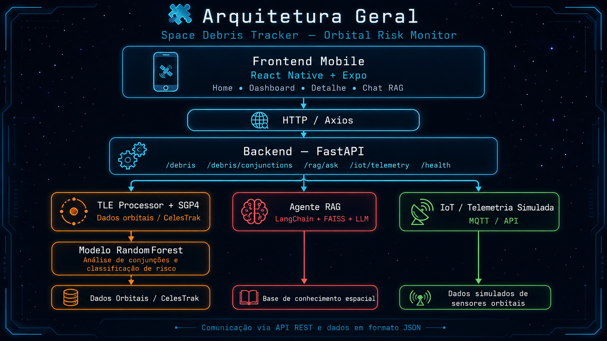
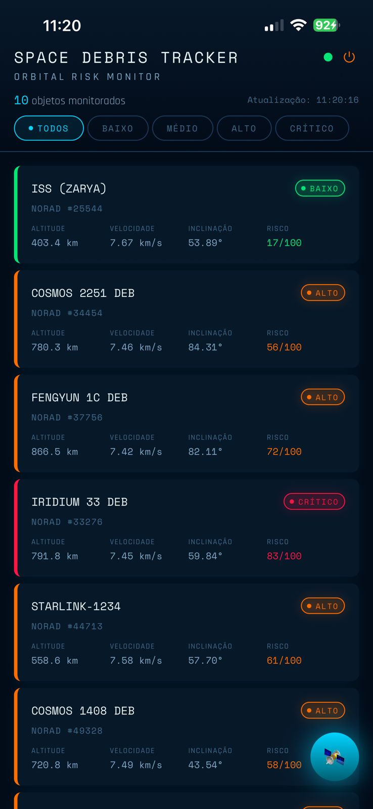
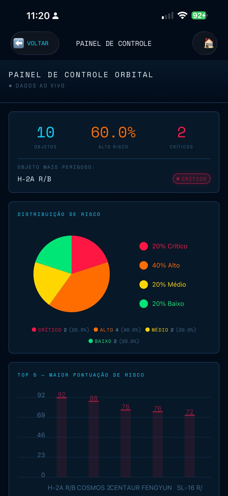
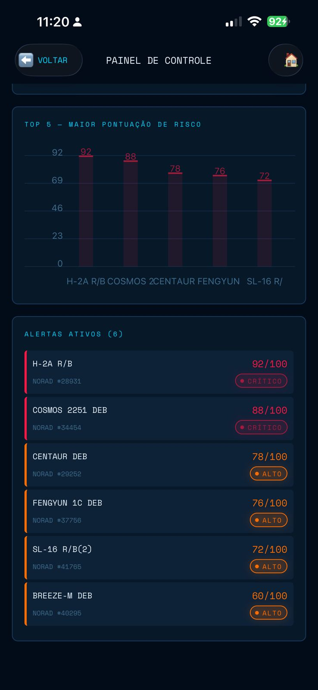

# 🛰️ Space Debris Tracker

## Global Solution 2026.1 — FIAP

**Curso:** Inteligência Artificial
**Fases:** 3 e 4
**Tema:** Economia Espacial
**Projeto:** Space Debris Tracker — Orbital Risk Monitor

---

## 👥 Integrantes

| Nome                    |       RM | E-mail                                                          | Função                       |
| ----------------------- | -------: | --------------------------------------------------------------- | ---------------------------- |
| João Vittor             | RM565999 | [fontesjoaovittor@gmail.com](mailto:fontesjoaovittor@gmail.com) | Cientista de Dados & IA      |
| Tayna Esteves           | RM562491 | [esteves.tayna96@gmail.com](mailto:esteves.tayna96@gmail.com)   | Engenheira de Sistemas & IoT |
| Carlos Souza            | RM566487 | [carlos.souza004@gmail.com](mailto:carlos.souza004@gmail.com)   | Desenvolvedor de Interface   |
| Endrew Alves dos Santos | RM563646 | [endrewalves42@gmail.com](mailto:endrewalves42@gmail.com)       | Documentador & Apresentador  |

---

## 👩‍🏫 Professores

| Papel       | Nome                           |
| ----------- | ------------------------------ |
| Tutor       | Caique Nonato da Silva Bezerra |
| Coordenador | André Godoi Chiovato           |

---

## 📌 Nome da Solução

**Space Debris Tracker**

---

## 🚀 Descrição do Projeto

O **Space Debris Tracker** é uma prova de conceito desenvolvida para a **Global Solution 2026.1 da FIAP**, com foco no tema **Economia Espacial**.

A solução propõe uma plataforma de monitoramento de objetos orbitais e detritos espaciais, permitindo visualizar informações como altitude, velocidade, inclinação orbital, código NORAD e nível de risco. O objetivo é demonstrar como tecnologias de Inteligência Artificial, análise de dados, aplicações distribuídas, backend, frontend mobile e automação podem apoiar a tomada de decisão no setor espacial.

O sistema foi desenvolvido com uma arquitetura cliente-servidor. O backend processa dados orbitais, executa serviços de análise e disponibiliza as informações por meio de uma API REST. O frontend mobile consome esses dados e apresenta uma interface visual para acompanhamento dos objetos monitorados, filtros por criticidade, dashboard e alertas ativos.

---

## 🎯 Problema

Com o crescimento da exploração espacial, da quantidade de satélites em órbita e da presença de fragmentos artificiais ao redor da Terra, o monitoramento de detritos orbitais se tornou uma necessidade estratégica.

Esses objetos podem representar riscos para satélites ativos, sistemas de comunicação, navegação, observação da Terra, missões espaciais e futuras operações comerciais no espaço.

O problema abordado pelo projeto é:

> Como utilizar Inteligência Artificial, análise de dados e aplicações distribuídas para monitorar objetos orbitais e apoiar a análise de risco no contexto da nova economia espacial?

---

## 💡 Solução Proposta

A solução proposta é uma plataforma de monitoramento orbital composta por cinco camadas principais:

1. **IA e Dados**
   Processamento de dados orbitais, uso de SGP4 e análise de risco com modelo de Machine Learning.

2. **Agente RAG**
   Sistema de perguntas e respostas em português sobre detritos espaciais, utilizando LangChain, FAISS e modelo de linguagem.

3. **Backend**
   API REST desenvolvida com FastAPI para disponibilizar dados, serviços de IA, telemetria e atualizações ao frontend.

4. **IoT / Telemetria Simulada**
   Camada responsável por simular o envio de dados orbitais e representar uma possível integração com sensores ou sistemas embarcados.

5. **Frontend Mobile**
   Aplicativo em React Native com Expo para visualização dos objetos monitorados, filtros de risco, dashboard e alertas operacionais.

Por se tratar de uma prova de conceito, a pontuação de risco exibida no aplicativo possui finalidade demonstrativa e operacional, baseada nos dados orbitais disponíveis e nas regras implementadas no sistema. Além disso, o projeto implementa um modelo **RandomForest** para análise de conjunções orbitais entre pares de objetos, utilizando variáveis como distância mínima e velocidade relativa.

---

## 🧠 Objetivo Geral

Desenvolver uma prova de conceito capaz de integrar Inteligência Artificial, análise de dados, backend, frontend mobile, automação e telemetria simulada para monitoramento e análise de risco de objetos orbitais no contexto da economia espacial.

---

## ✅ Objetivos Específicos

* Monitorar objetos orbitais e detritos espaciais.
* Exibir informações como altitude, velocidade, inclinação orbital e código NORAD.
* Classificar objetos por nível de risco.
* Disponibilizar os dados por meio de uma API REST.
* Criar uma interface mobile para visualização dos dados.
* Implementar filtros por criticidade.
* Apresentar indicadores em dashboard.
* Utilizar modelo de Machine Learning para análise de conjunções orbitais.
* Implementar um agente RAG para responder perguntas sobre detritos espaciais.
* Simular entrada de telemetria por camada IoT.
* Demonstrar a integração entre backend, frontend, IA e dados.

---

## 🧩 Arquitetura Geral

<p align="center">
  
</p>

A arquitetura do projeto foi organizada em camadas. O frontend mobile, desenvolvido em React Native com Expo, consome os serviços disponibilizados pelo backend FastAPI. O backend centraliza o processamento dos dados orbitais, a análise de conjunções com Machine Learning, o agente RAG e a camada de telemetria simulada. A comunicação entre as camadas ocorre por meio de API REST e dados em formato JSON.

---

## 🔎 Descrição da Arquitetura

### 1. Frontend Mobile

O frontend foi desenvolvido em **React Native com Expo**. Ele é responsável por apresentar os dados ao usuário de forma visual e interativa.

Principais telas:

* **Home:** listagem dos objetos orbitais com filtros por risco;
* **Dashboard:** gráficos, indicadores e alertas;
* **Detalhe:** visualização de informações específicas de um objeto;
* **Agente RAG:** chat para perguntas em português sobre detritos espaciais.

### 2. Backend

O backend foi desenvolvido em **Python com FastAPI**. Ele centraliza a lógica principal do sistema e expõe os serviços por meio de uma API REST.

Responsabilidades do backend:

* processar dados orbitais;
* disponibilizar objetos monitorados;
* calcular e organizar indicadores;
* executar análise de conjunções orbitais;
* receber telemetria simulada;
* integrar o agente RAG;
* fornecer endpoints para o aplicativo mobile.

### 3. Camada de IA

A camada de Inteligência Artificial é composta por:

* processamento orbital com SGP4;
* análise de conjunções com modelo RandomForest;
* agente RAG com LangChain, FAISS e modelo de linguagem.

### 4. Camada IoT

A camada IoT simula o envio de telemetria orbital, representando como sensores, dispositivos embarcados ou sistemas remotos poderiam fornecer dados para a plataforma.

### 5. Comunicação

A comunicação entre frontend e backend ocorre por meio de:

* REST API;
* JSON;
* Axios no frontend;
* FastAPI no backend.

---

## 🛠️ Tecnologias Utilizadas

### Backend e IA

| Tecnologia    | Versão/Referência | Uso                                      |
| ------------- | ----------------- | ---------------------------------------- |
| Python        | 3.10+             | Linguagem principal do backend           |
| FastAPI       | 0.111.0           | Criação da API REST                      |
| Uvicorn       | 0.29.0            | Servidor ASGI                            |
| SGP4          | 2.23              | Propagação orbital a partir de dados TLE |
| Scikit-learn  | 1.4.2             | Modelo RandomForest                      |
| Pandas        | 2.2.2             | Manipulação de dados                     |
| NumPy         | 1.26.4            | Operações numéricas                      |
| Pydantic      | 2.7.1             | Validação de dados                       |
| Python-dotenv | 1.0.1             | Variáveis de ambiente                    |
| Requests      | 2.31.0            | Requisições HTTP                         |

### IA Generativa e RAG

| Tecnologia          | Versão/Referência | Uso                                |
| ------------------- | ----------------- | ---------------------------------- |
| LangChain           | 0.2.1             | Orquestração do agente RAG         |
| LangChain OpenAI    | 0.1.8             | Integração com modelo de linguagem |
| LangChain Community | 0.2.1             | Componentes auxiliares             |
| FAISS CPU           | 1.8.0             | Busca vetorial                     |
| OpenAI SDK          | 1.30.1            | Geração de respostas do agente     |

### Frontend Mobile

| Tecnologia             | Versão/Referência | Uso                             |
| ---------------------- | ----------------- | ------------------------------- |
| React Native           | —                 | Desenvolvimento mobile          |
| Expo                   | SDK 54            | Execução e testes do aplicativo |
| Expo Router            | —                 | Navegação entre telas           |
| TypeScript             | ~5.3.3            | Tipagem do frontend             |
| Axios                  | —                 | Comunicação HTTP com a API      |
| React Native Chart Kit | —                 | Gráficos e visualizações        |
| Expo Linear Gradient   | —                 | Gradientes e efeitos visuais    |
| Space Mono             | —                 | Fonte para dados técnicos       |
| Rajdhani               | —                 | Fonte para textos e labels      |
| Expo Go                | —                 | Execução em dispositivo móvel   |

### IoT e Comunicação

| Tecnologia | Uso                                  |
| ---------- | ------------------------------------ |
| MQTT       | Comunicação de telemetria simulada   |
| Paho MQTT  | Publicação de mensagens MQTT         |
| HiveMQ     | Broker MQTT utilizado na simulação   |
| REST API   | Comunicação entre backend e frontend |
| JSON       | Formato de troca de dados            |

---

## 📱 Funcionalidades Implementadas

A aplicação mobile possui as seguintes funcionalidades:

* monitoramento de objetos orbitais;
* exibição do código NORAD;
* exibição de altitude, velocidade e inclinação orbital;
* exibição da pontuação de risco;
* classificação por nível de criticidade;
* filtros por risco: baixo, médio, alto e crítico;
* listagem de objetos monitorados;
* painel de controle orbital;
* gráfico de distribuição de risco;
* ranking dos objetos com maior pontuação de risco;
* lista de alertas ativos;
* status operacional da API;
* atualização dinâmica das informações exibidas;
* integração com backend via API REST;
* chat com agente RAG;
* telemetria simulada para representar IoT.

---

## 🖥️ Telas da Aplicação

A interface do **Space Debris Tracker** utiliza uma estética espacial e tecnológica, inspirada em painéis de controle de missão orbital.

### Tela Principal

Exibe os objetos orbitais monitorados, com informações técnicas e classificação de risco.

```md

```

### Filtros por Risco

Permite visualizar objetos de acordo com o nível de criticidade: baixo, médio, alto ou crítico.

```md

```

### Painel de Controle

Apresenta indicadores gerais, distribuição de risco e ranking dos objetos mais perigosos.

```md

```

### Alertas Ativos

Exibe objetos classificados com risco elevado, facilitando a análise operacional.

```md

```

> Caso os nomes das imagens sejam diferentes, atualize os caminhos conforme os arquivos presentes na pasta `docs`.

---

## 🎨 Design System

O aplicativo utiliza uma estética **espacial / sci-fi sombria**, com cores de alto contraste para destacar estados operacionais e níveis de risco.

| Token         | Valor      | Uso                               |
| ------------- | ---------- | --------------------------------- |
| background    | `#020B18`  | Fundo principal                   |
| surface       | `#071829`  | Cards e superfícies               |
| accent        | `#00D4FF`  | Ciano elétrico para destaque      |
| riskLow       | `#00E676`  | Verde para risco baixo            |
| riskMedium    | `#FFD600`  | Amarelo para risco médio          |
| riskHigh      | `#FF6D00`  | Laranja para risco alto           |
| riskCritical  | `#FF1744`  | Vermelho para risco crítico       |
| Fonte display | Space Mono | IDs, coordenadas e dados técnicos |
| Fonte corpo   | Rajdhani   | Textos, labels e navegação        |

---

## 🔗 Integração Backend–Frontend

A comunicação entre backend e frontend foi implementada por meio de uma API REST desenvolvida em Python com FastAPI.

O backend é responsável por:

* disponibilizar os dados orbitais monitorados;
* processar indicadores de risco;
* executar a análise de conjunções orbitais;
* disponibilizar endpoints para consulta;
* receber dados de telemetria simulada;
* fornecer respostas do agente RAG.

O frontend mobile consome os serviços da API utilizando Axios, centralizando as chamadas no arquivo:

```text
space-debris-tracker/frontend/services/api.ts
```

A URL da API pode ser configurada pela variável de ambiente:

```env
EXPO_PUBLIC_API_URL=http://localhost:8000
```

Para testes no celular com Expo Go, é necessário usar o endereço IPv4 da máquina que está executando o backend:

```env
EXPO_PUBLIC_API_URL=http://SEU_IPV4:8000
```

Exemplo:

```env
EXPO_PUBLIC_API_URL=http://192.168.2.132:8000
```

---

## 🔌 API REST — Endpoints

Base URL local:

```text
http://localhost:8000
```

| Método | Endpoint               | Descrição                                |
| ------ | ---------------------- | ---------------------------------------- |
| GET    | `/`                    | Retorna o status principal da API        |
| GET    | `/health/`             | Verifica se a API está online            |
| GET    | `/debris/`             | Lista os objetos orbitais monitorados    |
| GET    | `/debris/conjunctions` | Lista conjunções orbitais de maior risco |
| POST   | `/rag/ask`             | Envia pergunta para o agente RAG         |
| POST   | `/iot/telemetry`       | Recebe telemetria simulada               |
| POST   | `/update/`             | Atualiza dados orbitais                  |

---

## 📡 Exemplos de Requisições

### Health Check

```bash
curl http://localhost:8000/health/
```

Exemplo de resposta:

```json
{
  "status": "online",
  "service": "Space Debris Tracker API",
  "message": "API disponível para receber requisições"
}
```

### Listar Objetos Orbitais

```bash
curl http://localhost:8000/debris/
```

### Consultar Conjunções Orbitais

```bash
curl http://localhost:8000/debris/conjunctions
```

### Perguntar ao Agente RAG

```bash
curl -X POST http://localhost:8000/rag/ask \
  -H "Content-Type: application/json" \
  -d '{"question": "O que são debris espaciais?"}'
```

### Enviar Telemetria Simulada

```bash
curl -X POST http://localhost:8000/iot/telemetry \
  -H "Content-Type: application/json" \
  -d '{
    "object_id": "DEB-001",
    "altitude_km": 412.5,
    "velocity_kms": 7.8,
    "distance_to_nearest_object_km": 1.2
  }'
```

---

## 🤖 Componentes de IA

### TLE Processor

Arquivo principal:

```text
src/ai/tle_processor.py
```

Responsável por processar dados orbitais em formato TLE e utilizar a biblioteca SGP4 para propagação orbital. A partir desses dados, o sistema organiza informações como altitude, velocidade, inclinação e identificação dos objetos monitorados.

Em caso de indisponibilidade da fonte externa, o sistema pode utilizar cache local dos dados orbitais.

---

### Collision Model

Arquivo principal:

```text
src/ai/collision_model.py
```

O modelo de colisão utiliza **RandomForest** para análise de conjunções orbitais entre pares de objetos.

Variáveis utilizadas:

* distância mínima entre objetos;
* velocidade relativa.

Classificação utilizada na análise:

| Condição                     | Risco |
| ---------------------------- | ----- |
| Distância menor que 5 km     | Alto  |
| Distância entre 5 km e 50 km | Médio |
| Distância maior que 50 km    | Baixo |

Essa análise demonstra como Machine Learning pode ser aplicado para apoiar a identificação de possíveis situações de risco orbital.

---

### Agente RAG

Arquivo principal:

```text
src/ai/rag_agent.py
```

O agente RAG utiliza uma base de conhecimento sobre detritos espaciais, Síndrome de Kessler, formato TLE, propagação orbital SGP4 e iniciativas de mitigação.

O objetivo é permitir que o usuário faça perguntas em português sobre o tema e receba respostas explicativas.

Endpoint utilizado:

```text
POST /rag/ask
```

Exemplo de pergunta:

```text
O que são debris espaciais?
```

---

## 📡 Camada IoT e Telemetria Simulada

A camada de IoT foi criada para representar o recebimento de dados de sensores ou dispositivos embarcados.

Nesta POC, a telemetria é simulada e enviada para o backend, permitindo testar o fluxo de recebimento, processamento e classificação de risco.

### MQTT Publisher

Arquivo principal:

```text
src/iot/mqtt_publisher.py
```

Publica telemetria simulada no broker MQTT.

### Telemetry Generator

Arquivo principal:

```text
src/iot/telemetry_generator.py
```

Gera payloads simulados com:

* `object_id`;
* `altitude_km`;
* `velocity_kms`;
* `distance_to_nearest_object_km`.

Exemplo de dados simulados:

```json
{
  "object_id": "DEB-001",
  "altitude_km": 412.5,
  "velocity_kms": 7.8,
  "distance_to_nearest_object_km": 1.2
}
```

### Classificação da Telemetria

A classificação do risco na telemetria simulada considera a distância ao objeto mais próximo.

| Distância          | Risco |
| ------------------ | ----- |
| Menor que 2 km     | Alto  |
| Entre 2 km e 10 km | Médio |
| Maior que 10 km    | Baixo |

---

## 📂 Estrutura do Projeto

```text
Global-Solution---1-Semestre/
│
├── README.md
├── package-lock.json
│
└── space-debris-tracker/
    │
    ├── .env.example
    ├── .gitignore
    ├── README.md
    ├── requirements.txt
    ├── docker-compose.yml
    │
    ├── data/
    │   └── tle_cache.json
    │
    ├── docs/
    │   ├── tela-principal.jpg
    │   ├── filtros-risco.jpg
    │   ├── painel-controle.jpg
    │   ├── alertas-ativos.jpg
    │   └── readme_expo_go.md
    │
    ├── frontend/
    │   ├── app/
    │   │   ├── _layout.tsx
    │   │   ├── index.tsx
    │   │   ├── dashboard.tsx
    │   │   ├── agent.tsx
    │   │   └── debris/
    │   │       └── [id].tsx
    │   │
    │   ├── components/
    │   │   ├── DebrisCard.tsx
    │   │   ├── RiskBadge.tsx
    │   │   ├── RiskChart.tsx
    │   │   ├── ChatBubble.tsx
    │   │   └── LoadingSpinner.tsx
    │   │
    │   ├── services/
    │   │   └── api.ts
    │   │
    │   ├── hooks/
    │   │   └── useDebris.ts
    │   │
    │   ├── types/
    │   │   └── index.ts
    │   │
    │   ├── constants/
    │   │   └── theme.ts
    │   │
    │   ├── package.json
    │   └── tsconfig.json
    │
    ├── notebooks/
    │   └── exploratory_analysis.ipynb
    │
    ├── src/
    │   ├── ai/
    │   │   ├── collision_model.py
    │   │   ├── rag_agent.py
    │   │   └── tle_processor.py
    │   │
    │   ├── api/
    │   │   ├── main.py
    │   │   ├── routes/
    │   │   │   ├── debris_routes.py
    │   │   │   ├── health_routes.py
    │   │   │   ├── iot_routes.py
    │   │   │   ├── rag_routes.py
    │   │   │   └── update_routes.py
    │   │   │
    │   │   └── services/
    │   │       ├── debris_service.py
    │   │       ├── iot_service.py
    │   │       ├── rag_service.py
    │   │       └── update_service.py
    │   │
    │   ├── iot/
    │   │   ├── mqtt_publisher.py
    │   │   ├── mqtt_subscriber.py
    │   │   ├── sensor_simulator.py
    │   │   └── telemetry_generator.py
    │   │
    │   └── testes/
    │       ├── test_api.py
    │       ├── test_model.py
    │       └── test_rag.py
    │
    └── tests/
```

---

## ⚙️ Como Executar o Projeto

### Pré-requisitos

Antes de executar o projeto, é necessário ter instalado:

* Python 3.10 ou superior;
* Node.js 18 ou superior;
* Git;
* pip;
* Expo Go no celular, caso deseje testar em dispositivo móvel;
* chave de API da OpenAI, caso deseje utilizar o agente RAG.

---

## 🔧 Execução do Backend

### 1. Clonar o repositório

```bash
git clone https://github.com/JV-004/Global-Solution---1-Semestre.git
```

### 2. Acessar a pasta do projeto

```bash
cd Global-Solution---1-Semestre/space-debris-tracker
```

### 3. Criar ambiente virtual

#### Windows

```bash
python -m venv venv
venv\Scripts\activate
```

#### Linux / macOS

```bash
python3 -m venv venv
source venv/bin/activate
```

### 4. Instalar dependências

```bash
pip install -r requirements.txt
```

### 5. Configurar variáveis de ambiente

Crie um arquivo `.env` com base no arquivo `.env.example`.

#### Windows

```bash
copy .env.example .env
```

#### Linux / macOS

```bash
cp .env.example .env
```

Exemplo de configuração:

```env
OPENAI_API_KEY=sua_chave_aqui

API_HOST=0.0.0.0
API_PORT=8000

MQTT_BROKER=broker.hivemq.com
MQTT_PORT=1883
MQTT_TOPIC=space_debris_tracker/telemetry
```

> A variável `OPENAI_API_KEY` é necessária para o funcionamento do agente RAG. Sem ela, o restante da API pode ser executado, mas o agente pode não responder corretamente.

### 6. Iniciar o backend

```bash
python -m uvicorn src.api.main:app --host 0.0.0.0 --port 8000 --reload
```

Também é possível iniciar com:

```bash
uvicorn src.api.main:app --host 0.0.0.0 --port 8000 --reload
```

Após iniciar, a API estará disponível em:

```text
http://localhost:8000
```

A documentação automática do FastAPI estará disponível em:

```text
http://localhost:8000/docs
```

---

## 📲 Execução do Frontend Mobile

### 1. Acessar a pasta do frontend

A partir da pasta `space-debris-tracker`, execute:

```bash
cd frontend
```

### 2. Instalar dependências

```bash
npm install
```

### 3. Configurar a URL da API

Crie um arquivo `.env` dentro da pasta `frontend` e configure:

```env
EXPO_PUBLIC_API_URL=http://localhost:8000
```

Para testar no celular usando Expo Go, substitua `localhost` pelo IPv4 da máquina onde o backend está rodando.

Exemplo:

```env
EXPO_PUBLIC_API_URL=http://192.168.2.132:8000
```

Para descobrir o IP local:

#### Windows

```bash
ipconfig
```

#### Linux / macOS

```bash
ifconfig
```

O celular e o computador precisam estar conectados à mesma rede Wi-Fi.

### 4. Iniciar o aplicativo

```bash
npm start
```

Ou:

```bash
npx expo start
```

### 5. Abrir no celular

Após iniciar o Expo, escaneie o QR Code com o aplicativo Expo Go.

Caso a variável de ambiente seja alterada, reinicie o Expo com limpeza de cache:

```bash
npx expo start --clear
```

---

## 📡 Executar Publisher IoT

A execução do publisher IoT é opcional.

Em um terminal separado, com o ambiente virtual ativado, execute:

```bash
cd src/iot
python mqtt_publisher.py
```

O publisher enviará telemetria simulada ao broker MQTT configurado.

---

## 🧪 Testes e Validação

A validação do projeto pode ser feita em três etapas:

### 1. Validação da API

Acesse:

```text
http://localhost:8000/health/
```

Resultado esperado:

```json
{
  "status": "online",
  "service": "Space Debris Tracker API",
  "message": "API disponível para receber requisições"
}
```

### 2. Validação dos dados orbitais

Acesse:

```text
http://localhost:8000/debris/
```

O retorno esperado é uma lista de objetos orbitais monitorados.

### 3. Validação do aplicativo

No aplicativo mobile, valide:

* carregamento da lista de objetos;
* funcionamento dos filtros;
* exibição dos dados orbitais;
* navegação para o dashboard;
* exibição de gráficos;
* exibição de alertas ativos;
* atualização do horário dos dados;
* comunicação com a API.

---

## 📊 Resultados Obtidos

A solução desenvolvida entrega uma POC funcional para monitoramento de objetos orbitais.

Entre os principais resultados obtidos estão:

* backend estruturado com FastAPI;
* API REST disponível para integração;
* aplicativo mobile funcional;
* visualização dos objetos orbitais monitorados;
* filtros por nível de risco;
* painel de controle orbital;
* gráfico de distribuição dos níveis de risco;
* ranking dos objetos com maior pontuação de risco;
* alertas ativos para objetos classificados como alto ou crítico;
* integração entre frontend e backend;
* camada de IA para análise de conjunções orbitais;
* agente RAG para perguntas sobre detritos espaciais;
* telemetria simulada para representar integração IoT.

---

## 🔒 Segurança

O projeto adota algumas práticas básicas de segurança e organização:

* chaves de API armazenadas em variáveis de ambiente;
* arquivo `.env` não deve ser enviado ao repositório;
* o frontend não chama diretamente serviços de LLM;
* as chamadas ao agente RAG passam pelo backend;
* a variável `EXPO_PUBLIC_API_URL` contém apenas o endereço da API;
* credenciais sensíveis não devem ser expostas no código-fonte.

---

## 🧭 Fluxo de Funcionamento

```text
1. O backend processa os dados orbitais.
2. A API disponibiliza os objetos monitorados.
3. O app mobile consome os dados via Axios.
4. A interface exibe cards com informações orbitais.
5. O usuário filtra objetos por nível de risco.
6. O dashboard apresenta gráficos e alertas.
7. O agente RAG responde perguntas sobre debris espaciais.
8. A camada IoT recebe telemetria simulada.
```

---

## 📌 Divisão de Responsabilidades

| Integrante              | Responsabilidade                                                             |
| ----------------------- | ---------------------------------------------------------------------------- |
| João Vittor             | Desenvolvimento da camada de dados, IA, análise orbital e modelo de risco    |
| Tayna Esteves           | Estrutura de sistemas, integração, IoT, telemetria e suporte à arquitetura   |
| Carlos Souza            | Desenvolvimento da interface mobile, dashboard, telas e experiência visual   |
| Endrew Alves dos Santos | Documentação, organização do README, estrutura do PDF e apoio à apresentação |

---

## 🎥 Demonstração em Vídeo

O vídeo demonstrativo apresenta o funcionamento da aplicação mobile, incluindo:

* tela principal;
* filtros por criticidade;
* objetos orbitais monitorados;
* painel de controle;
* gráfico de distribuição de risco;
* alertas ativos;
* integração visual com os dados da API.

Link do vídeo no YouTube como não listado:

```text
[Inserir link do vídeo]
```

---

## 🔗 Links do Projeto

### Repositório GitHub

```text
https://github.com/JV-004/Global-Solution---1-Semestre/tree/main
```

### Vídeo Demonstrativo

```text
[Inserir link do YouTube não listado]
```

---

## ⚠️ Observações Importantes

* O projeto é uma POC, ou seja, uma prova de conceito.
* A pontuação de risco exibida no aplicativo tem finalidade demonstrativa.
* O modelo de Machine Learning é aplicado à análise de conjunções orbitais.
* A telemetria IoT é simulada.
* Para o agente RAG funcionar corretamente, é necessário configurar `OPENAI_API_KEY`.
* Para testar o app no celular, o backend e o dispositivo móvel precisam estar na mesma rede.
* Ao usar Expo Go no celular, a URL da API deve usar o IPv4 da máquina, e não `localhost`.

---

## 📈 Possíveis Melhorias Futuras

Como evolução do projeto, seria possível implementar:

* integração com bases orbitais em tempo real;
* cálculo de risco com modelo mais robusto;
* autenticação de usuários;
* histórico de alertas;
* notificações push para objetos críticos;
* mapa orbital interativo;
* integração com sensores físicos;
* painel web para operadores;
* deploy do backend em nuvem;
* publicação do app em ambiente de testes.

---

## 📄 Licença

Projeto acadêmico desenvolvido para a **Global Solution 2026.1 — FIAP**.

Curso de Inteligência Artificial — Fases 3 e 4.

---

## 🏁 Conclusão

O **Space Debris Tracker** demonstra como Inteligência Artificial, análise de dados, backend, frontend mobile e automação podem ser integrados para criar uma solução aplicada à economia espacial.

A POC apresenta uma plataforma funcional de monitoramento orbital, permitindo visualizar objetos, consultar dados técnicos, filtrar níveis de risco e acompanhar indicadores por meio de um aplicativo mobile.

Mesmo em formato de prova de conceito, a solução mostra potencial de evolução para cenários reais de monitoramento espacial, apoio à tomada de decisão e análise de riscos orbitais.
